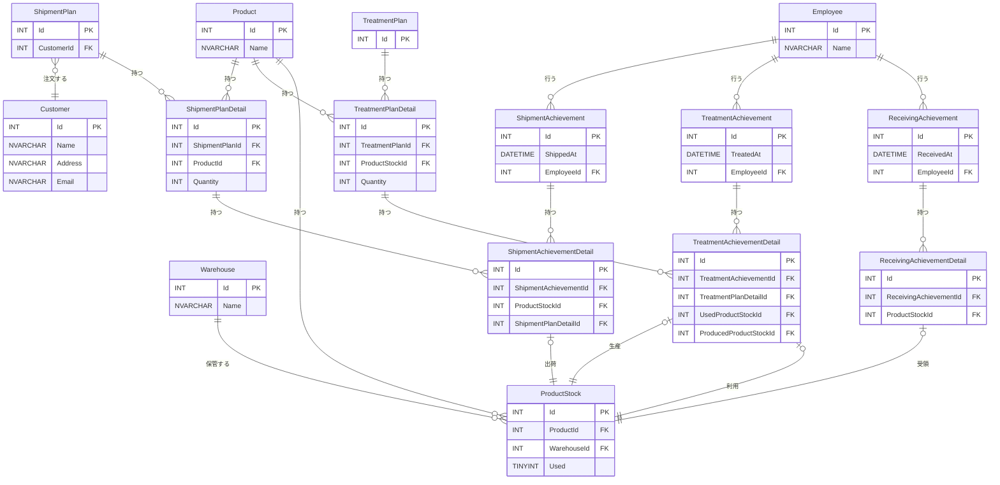

# SQL Server インデックス・パフォーマンス検証プロジェクト

このプロジェクトは、SQL Serverにおけるインデックス設計とクエリパフォーマンスを実際のデータベース環境で検証・学習するためのものです。製造業の業務システムをモデル化したデータベース構造を使用し、大規模なテストデータを生成してパフォーマンス測定を行います。

## プロジェクトの目的

- **インデックス設計の効果検証**: 複数のインデックス設計パターンでのクエリパフォーマンス比較
- **実際のワークロード検証**: 製造業でよくある業務シナリオでのSQL実行計画分析
- **パフォーマンスチューニング学習**: 実データを使用したボトルネック特定と改善手法の習得
- **大規模データでの挙動確認**: 億単位のレコードでのインデックス効果測定

## データベース構造

製造業の基幹システムを想定したテーブル設計：
- 受領業務（原材料の入庫管理）
- 加工業務（製品の製造・加工）
- 出荷業務（完成品の出荷管理）

### テストデータ規模
- 従業員: 1,000件
- 製品: 1,000件
- 倉庫: 1,000件
- 顧客: 1,000件
- 受領実績: 1億件（詳細100-1,000件/実績）
- 加工実績: 1億件（詳細100-1,000件/実績）
- 出荷実績: 1億件（詳細100-1,000件/実績）

## 環境構築

### 前提条件
- Docker & Docker Compose
- Node.js 18以上

### データベース起動

```bash
docker-compose up -d
```

### テーブル作成

```bash
# SQL Server Management Studio または sqlcmd でsql/create-tables.sql を実行
sqlcmd -S 127.0.0.1 -U sa -P 'YourStrong!Passw0rd' -i sql/create-tables.sql
```

### テストデータ生成

```bash
cd tool
npm install
npm start
```

## 検証項目（開発予定）

### 1. 基本インデックス検証
- クラスタ化インデックス vs 非クラスタ化インデックス
- 単一列インデックス vs 複合インデックス
- カバリングインデックスの効果

### 2. 業務シナリオ別検証
- 受領実績の期間別集計クエリ
- 製品別在庫照会クエリ
- 顧客別出荷履歴検索
- 従業員別作業実績集計

### 3. パフォーマンス測定項目
- 実行時間測定
- I/O統計（論理読み取り、物理読み取り）
- 実行プラン分析
- インデックス使用状況

### 4. チューニング手法検証
- インデックスヒント使用効果
- 統計情報更新による改善
- パーティショニング効果
- クエリ最適化テクニック

## 今後の開発方針

1. **段階的インデックス追加**: 基本的なインデックスから複雑な複合インデックスまで段階的に追加
2. **ベンチマークスクリプト作成**: 自動化されたパフォーマンス測定ツールの開発
3. **可視化ツール開発**: パフォーマンス結果のグラフ化・比較ツール
4. **ドキュメント充実**: 検証結果とベストプラクティスの文書化
5. **実シナリオ追加**: より実際の業務に近いクエリパターンの追加

## アーキテクチャ

このプロジェクトはクリーンアーキテクチャに基づいて設計されており、以下の層に分離されています：

### ディレクトリ構造
```
tool/
├── src/
│   ├── domain/          # ドメイン層 (ビジネスロジック)
│   │   ├── entities/    # エンティティ・バリューオブジェクト
│   │   └── use-cases/   # ユースケース
│   ├── infrastructure/  # インフラ層 (外部依存)
│   │   ├── data-sources/# データソース (Prisma)
│   │   └── repositories/# リポジトリ実装
│   ├── presentation/    # プレゼンテーション層 (UI)
│   │   ├── cli/         # CLI インターフェース
│   │   └── controllers/ # コントローラー
│   ├── di/              # Dependency Injection
│   └── shared/          # 共通機能
│       ├── errors/      # エラー定義
│       └── logging/     # ログ機能
├── main-clean.ts        # クリーンアーキテクチャ版エントリーポイント
└── main.ts              # 旧版エントリーポイント (互換性維持)
```

### 依存関係の方向
- **Domain** ← Infrastructure
- **Domain** ← Presentation
- **Infrastructure** → External (Prisma, Database)
- **Presentation** → External (Inquirer, Console)

### 主要なクラス・インターフェース
- `DataGenerationConfig`: データ生成設定のエンティティ
- `GenerateTestDataUseCase`: データ生成のユースケース
- `TestDataRepository`: データ永続化の実装
- `InquirerUserInteraction`: CLI経由のユーザー操作
- `DIContainer`: 依存関係の管理

## 学習効果を最大化するためのアプローチ

- **仮説検証型**: インデックス設計前に仮説を立て、結果を検証
- **比較分析**: 複数のアプローチを同時に測定し比較
- **実行計画理解**: SQL Serverの実行計画を詳細に分析
- **継続的改善**: 測定結果を基に継続的にクエリとインデックスを改善

## データベースの構造

### 概略


### 詳細



### 受領


### 加工


### 出荷


