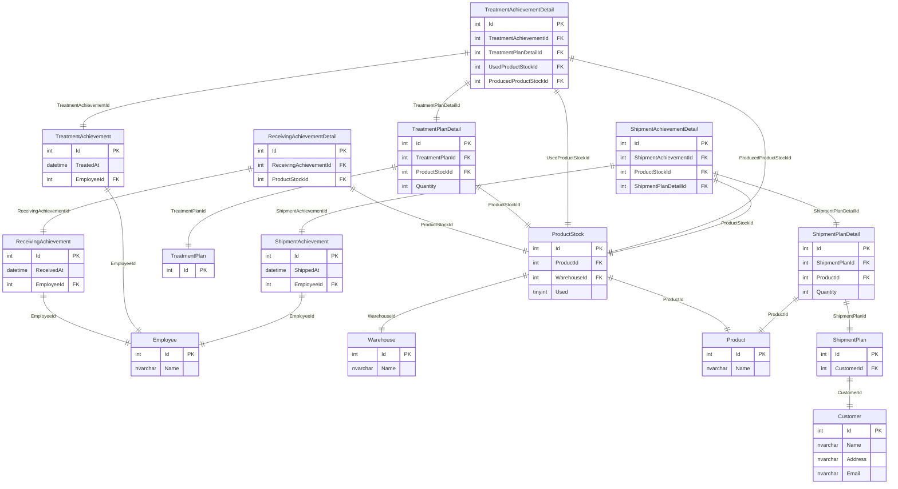
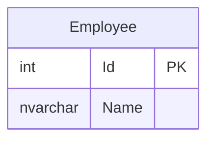
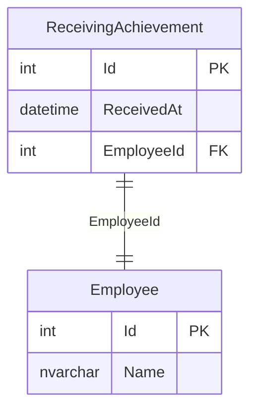
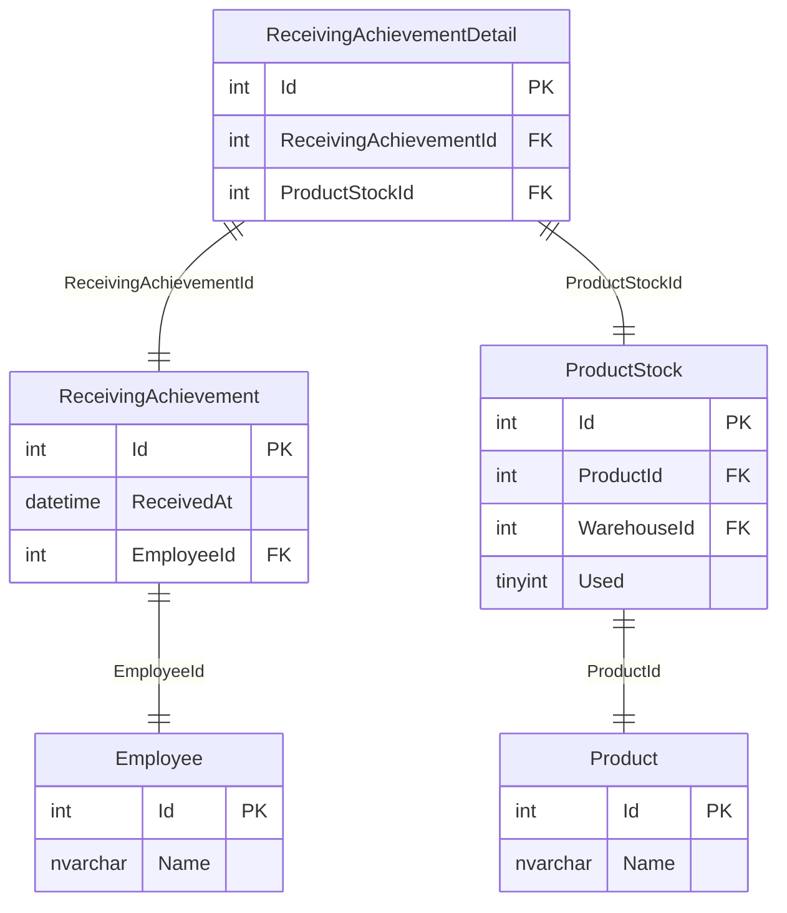
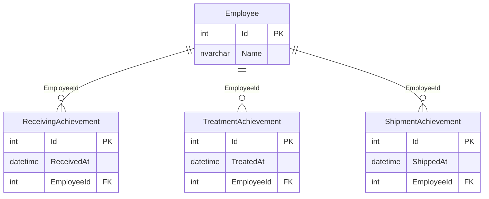
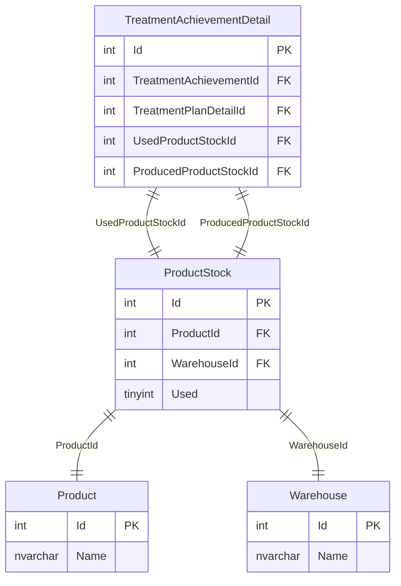
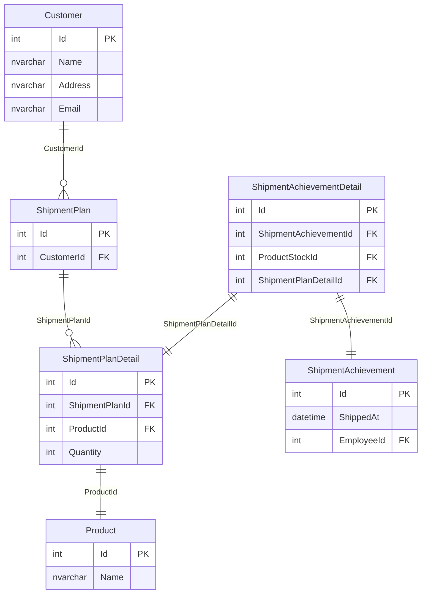

# 動作検証手順書

## 概要

SQL Serverパフォーマンステストプロジェクトの動作検証を段階的に実施する手順書です。
データ生成後のテーブル構造確認から、複雑なクエリによるパフォーマンス測定まで、段階を追って検証を行います。

## データベーススキーマ全体図



## 前提条件

- SQL Serverコンテナが起動済み (`docker-compose up -d`)
- テーブルが作成済み (`sqlcmd -S 127.0.0.1 -U sa -P 'YourStrong!Passw0rd' -i sql/create-tables.sql`)
- テストデータが生成済み (`cd tool && npm start`)

## SQL実行方法

### sqlcmdコマンドライン（推奨）

パフォーマンス測定に最適な実行方法：

```bash
# 個別のSQLファイルを実行
sqlcmd -S 127.0.0.1 -U sa -P 'YourStrong!Passw0rd' -i docs/01-table-existence-check.sql

# 結果をファイルに出力
sqlcmd -S 127.0.0.1 -U sa -P 'YourStrong!Passw0rd' -i docs/01-table-existence-check.sql -o results/01-results.txt

# 全てのテストを順次実行
for i in {01..14}; do
  echo "=== Test $i 実行中 ==="
  sqlcmd -S 127.0.0.1 -U sa -P 'YourStrong!Passw0rd' -i docs/${i}-*.sql -o results/${i}-results.txt
done
```

### バッチ実行スクリプト

以下のスクリプト（`run-all-tests.sh`）で全テストを実行：

```bash
#!/bin/bash
mkdir -p results
echo "=== SQL Serverパフォーマンステスト開始 ==="
echo "$(date): テスト開始" > results/test-summary.txt

# 各テストファイルを順次実行
declare -A test_names=(
  ["01"]="テーブル存在確認"
  ["02"]="マスタデータ件数確認"
  ["03"]="トランザクションデータ件数確認"
  ["04"]="プライマリキー検索"
  ["05"]="プライマリキー範囲検索"
  ["06"]="非インデックス検索"
  ["07"]="単純内部結合"
  ["08"]="複数テーブル結合"
  ["09"]="時系列集計"
  ["10"]="従業員生産性分析"
  ["11"]="在庫追跡"
  ["12"]="顧客出荷分析"
  ["13"]="実行計画確認"
  ["14"]="パフォーマンス比較"
)

for i in {01..14}; do
  test_file=$(ls docs/${i}-*.sql 2>/dev/null | head -1)
  if [ -f "$test_file" ]; then
    echo "=== Test $i: ${test_names[$i]} ===" | tee -a results/test-summary.txt
    echo "実行ファイル: $test_file" | tee -a results/test-summary.txt
    echo "$(date): 開始" | tee -a results/test-summary.txt

    sqlcmd -S 127.0.0.1 -U sa -P 'YourStrong!Passw0rd' -i "$test_file" -o "results/${i}-results.txt"

    echo "$(date): 完了" | tee -a results/test-summary.txt
    echo "" | tee -a results/test-summary.txt
  fi
done

echo "$(date): 全テスト完了" | tee -a results/test-summary.txt
echo "結果: resultsディレクトリを確認してください"
```

## 検証手順

### 段階1: 基本データ確認

#### 1.1 テーブル存在確認

**実行**:

```bash
sqlcmd -S 127.0.0.1 -U sa -P 'YourStrong!Passw0rd' -i docs/01-table-existence-check.sql
```

```sql
-- パフォーマンス統計を有効化
SET STATISTICS IO ON;
SET STATISTICS TIME ON;

-- 全テーブルの存在と基本情報を確認
SELECT
    TABLE_NAME,
    TABLE_TYPE
FROM INFORMATION_SCHEMA.TABLES
WHERE TABLE_TYPE = 'BASE TABLE'
ORDER BY TABLE_NAME;
```

**計算量**:

`O(n)`

- nはテーブル数（固定値のため実質O(1)）

#### 1.2 各テーブルのレコード数確認

**実行**:

```bash
sqlcmd -S 127.0.0.1 -U sa -P 'YourStrong!Passw0rd' -i docs/02-master-data-count.sql
```

```sql
-- 基本テーブルのレコード数
SELECT 'Employee' TableName, COUNT(*) RecordCount FROM Employee
UNION ALL
SELECT 'Customer', COUNT(*) FROM Customer
UNION ALL
SELECT 'Warehouse', COUNT(*) FROM Warehouse
UNION ALL
SELECT 'Product', COUNT(*) FROM Product
UNION ALL
SELECT 'ProductStock', COUNT(*) FROM ProductStock;
```

**計算量**:

`O(n1 + n2 + n3 + n4 + n5)`

- 各テーブルのフルスキャン

#### 1.3 実績テーブルのレコード数確認

**実行**:

```bash
sqlcmd -S 127.0.0.1 -U sa -P 'YourStrong!Passw0rd' -i docs/03-transaction-data-count.sql
```

```sql
-- 実績テーブルのレコード数（大量データ）
SELECT 'ReceivingAchievement' TableName, COUNT(*) RecordCount FROM ReceivingAchievement
UNION ALL
SELECT 'ReceivingAchievementDetail', COUNT(*) FROM ReceivingAchievementDetail
UNION ALL
SELECT 'TreatmentAchievement', COUNT(*) FROM TreatmentAchievement
UNION ALL
SELECT 'TreatmentAchievementDetail', COUNT(*) FROM TreatmentAchievementDetail
UNION ALL
SELECT 'ShipmentAchievement', COUNT(*) FROM ShipmentAchievement
UNION ALL
SELECT 'ShipmentAchievementDetail', COUNT(*) FROM ShipmentAchievementDetail;
```

**計算量**:

`O(m1 + m2 + m3 + m4 + m5 + m6)`

- 各実績テーブルのフルスキャン（mは数億件レベル）

### 段階2: 基本クエリ性能測定

#### 2.1 プライマリキー検索（最も高速）

**実行**:

```bash
sqlcmd -S 127.0.0.1 -U sa -P 'YourStrong!Passw0rd' -i docs/04-primary-key-search.sql
```



```sql
-- 単一レコード検索（プライマリキー使用）
SELECT Id, Name
FROM Employee
WHERE Id = 100;
```

**計算量**:

`O(log n)`

- B-Treeインデックス検索

#### 2.2 範囲検索（プライマリキー）

**実行**:

```bash
sqlcmd -S 127.0.0.1 -U sa -P 'YourStrong!Passw0rd' -i docs/05-primary-key-range-search.sql
```

```sql
-- ID範囲検索
SELECT Id, Name
FROM Employee
WHERE Id BETWEEN 100 AND 200
ORDER BY Id;
```

**計算量**:

`O(log n + k)`

- `n` は総レコード数
- `k` は結果件数

#### 2.3 非インデックス列での検索

**実行**:

```bash
sqlcmd -S 127.0.0.1 -U sa -P 'YourStrong!Passw0rd' -i docs/06-non-indexed-search.sql
```

```sql
-- 名前による検索（インデックスなし）
SELECT Id, Name
FROM Employee
WHERE Name LIKE '%Bergnaum';
```

**計算量**: O(n) - フルテーブルスキャン

### 段階3: 結合クエリ性能測定

#### 3.1 単純な内部結合

**実行**:
```bash
sqlcmd -S 127.0.0.1 -U sa -P 'YourStrong!Passw0rd' -i docs/07-simple-inner-join.sql
```



```sql
-- 受領実績と従業員の結合
SELECT
    ReceivingAchievement.Id,
    ReceivingAchievement.ReceivedAt,
    Employee.Name EmployeeName
FROM
    ReceivingAchievement
INNER JOIN Employee
    ON ReceivingAchievement.EmployeeId = Employee.Id
WHERE
    ReceivingAchievement.Id = 1000;
```

**計算量**:

`O(log n + log m)`

- 両テーブルのインデックス検索

#### 3.2 複数テーブル結合

2024年1月1日以降の受領実績を従業員、製品、在庫情報と結合して集計

**実行**:
```bash
sqlcmd -S 127.0.0.1 -U sa -P 'YourStrong!Passw0rd' -i docs/08-multi-table-join.sql
```



```sql
-- 受領実績の詳細情報（4テーブル結合）
SELECT
    ReceivingAchievement.ReceivedAt,
    Employee.Name EmployeeName,
    Product.Name ProductName,
    COUNT(ReceivingAchievementDetail.Id) DetailCount
FROM
    ReceivingAchievement
    INNER JOIN Employee
        ON ReceivingAchievement.EmployeeId = Employee.Id
    INNER JOIN ReceivingAchievementDetail
        ON ReceivingAchievement.Id = ReceivingAchievementDetail.ReceivingAchievementId
    INNER JOIN ProductStock
        ON ReceivingAchievementDetail.ProductStockId = ProductStock.Id
    INNER JOIN Product
        ON ProductStock.ProductId = Product.Id
WHERE
    ReceivingAchievement.ReceivedAt >= '2024-01-01'
GROUP BY
    ReceivingAchievement.ReceivedAt, Employee.Name, Product.Name
ORDER BY
    ReceivingAchievement.ReceivedAt DESC;
```

**計算量**:

`O(n * log m1 * log m2 * log m3)`

- nは主テーブルの検索結果数
- m1-m3は結合先テーブルサイズ

### 段階4: 集計クエリ性能測定

#### 4.1 時系列集計

**実行**:

```bash
sqlcmd -S 127.0.0.1 -U sa -P 'YourStrong!Passw0rd' -i docs/09-time-series-aggregation.sql
```

```sql
-- 月別受領実績集計
SELECT
    YEAR(ReceivedAt) Year,
    MONTH(ReceivedAt) Month,
    COUNT(*) AchievementCount,
    COUNT(DISTINCT EmployeeId) EmployeeCount
FROM ReceivingAchievement
WHERE ReceivedAt >= '2024-01-01'
GROUP BY YEAR(ReceivedAt), MONTH(ReceivedAt)
ORDER BY Year, Month;
```

**計算量**:

`O(n * log n)`

- nは条件に合致するレコード数、ソートコスト含む

#### 4.2 従業員別生産性分析

**実行**:

```bash
sqlcmd -S 127.0.0.1 -U sa -P 'YourStrong!Passw0rd' -i docs/10-employee-productivity-analysis.sql
```



```sql
-- 従業員別全工程実績集計
WITH EmployeeStats AS (
    SELECT
        Employee.Id,
        Employee.Name,
        COALESCE(Receiving.ReceivingCount, 0) ReceivingCount,
        COALESCE(Treatment.TreatmentCount, 0) TreatmentCount,
        COALESCE(Shipment.ShipmentCount, 0) ShipmentCount
    FROM Employee
    LEFT JOIN (
        SELECT
            EmployeeId,
            COUNT(*) ReceivingCount
        FROM
            ReceivingAchievement
        WHERE
            ReceivedAt >= '2024-01-01'
        GROUP BY
            EmployeeId
    ) Receiving ON Employee.Id = Receiving.EmployeeId
    LEFT JOIN (
        SELECT
            EmployeeId,
            COUNT(*) TreatmentCount
        FROM
            TreatmentAchievement
        WHERE
            TreatedAt >= '2024-01-01'
        GROUP BY
            EmployeeId
    ) Treatment ON Employee.Id = Treatment.EmployeeId
    LEFT JOIN (
        SELECT
            EmployeeId,
            COUNT(*) ShipmentCount
        FROM
            ShipmentAchievement
        WHERE
            ShippedAt >= '2024-01-01'
        GROUP BY
            EmployeeId
    ) Shipment ON Employee.Id = Shipment.EmployeeId
)
SELECT
    Name,
    ReceivingCount,
    TreatmentCount,
    ShipmentCount,
    (ReceivingCount + TreatmentCount + ShipmentCount) TotalCount
FROM
    EmployeeStats
WHERE
    (ReceivingCount + TreatmentCount + ShipmentCount) > 0
ORDER BY
    TotalCount DESC;
```

**計算量**:

`O(n + m1 + m2 + m3)`

- nは従業員数
- m1-m3は各実績テーブルの該当レコード数

### 段階5: 複雑な分析クエリ

#### 5.1 在庫移動追跡

**実行**:

```bash
sqlcmd -S 127.0.0.1 -U sa -P 'YourStrong!Passw0rd' -i docs/11-inventory-tracking.sql
```



```sql
-- 製品在庫の使用状況と移動履歴
SELECT
    Product.Name ProductName,
    Warehouse.Name WarehouseName,
    ProductStock.Used,
    CASE
        WHEN UsedIn.ProductStockCount > 0 THEN '原材料として使用済み'
        WHEN ProducedFrom.ProductStockCount > 0 THEN '加工により生産済み'
        ELSE '未使用'
    END Status,
    COALESCE(UsedIn.ProductStockCount, 0) UsedCount,
    COALESCE(ProducedFrom.ProductStockCount, 0) ProducedCount
FROM
    ProductStock
    INNER JOIN Product
        ON ProductStock.ProductId = Product.Id
    INNER JOIN Warehouse
        ON ProductStock.WarehouseId = Warehouse.Id
    LEFT JOIN (
        SELECT
            UsedProductStockId,
            COUNT(*) ProductStockCount
        FROM
            TreatmentAchievementDetail
        GROUP BY
            UsedProductStockId
    ) UsedIn
        ON ProductStock.Id = UsedIn.UsedProductStockId
    LEFT JOIN (
        SELECT
            ProducedProductStockId,
            COUNT(*) ProductStockCount
        FROM
            TreatmentAchievementDetail
        GROUP BY
            ProducedProductStockId
    ) ProducedFrom
        ON ProductStock.Id = ProducedFrom.ProducedProductStockId
WHERE
    Product.Id <= 10
ORDER BY
    Product.Name, Warehouse.Name;
```

**計算量**:

`O(n * log m1 * log m2)`

- nはProductStock数
- m1,m2は集計処理のコスト

#### 5.2 顧客別出荷実績分析

**実行**:

```bash
sqlcmd -S 127.0.0.1 -U sa -P 'YourStrong!Passw0rd' -i docs/12-customer-shipment-analysis.sql
```



```sql
-- 顧客別製品出荷実績（計画vs実績）
SELECT
    Customer.Name CustomerName,
    Product.Name ProductName,
    SUM(ShipmentPlanDetail.Quantity) PlannedQuantity,
    COUNT(ShipmentAchievementDetail.Id) ActualShipments,
    CAST(COUNT(ShipmentAchievementDetail.Id) AS FLOAT) / NULLIF(SUM(ShipmentPlanDetail.Quantity), 0) * 100 FulfillmentRate
FROM Customer
INNER JOIN ShipmentPlan
    ON Customer.Id = ShipmentPlan.CustomerId
INNER JOIN ShipmentPlanDetail
    ON ShipmentPlan.Id = ShipmentPlanDetail.ShipmentPlanId
INNER JOIN Product
    ON ShipmentPlanDetail.ProductId = Product.Id
LEFT JOIN ShipmentAchievementDetail
    ON ShipmentPlanDetail.Id = ShipmentAchievementDetail.ShipmentPlanDetailId
GROUP BY
    Customer.Name, Product.Name
HAVING
    SUM(ShipmentPlanDetail.Quantity) > 0
ORDER BY
    Customer.Name, FulfillmentRate DESC;
```

**計算量**:

`O(n * m * log k)`

- `n` は顧客数
- `m` は平均計画数
- `k` は実績データ数

### 段階6: パフォーマンス最適化検証

#### 6.1 実行計画の確認

**実行**:

```bash
sqlcmd -S 127.0.0.1 -U sa -P 'YourStrong!Passw0rd' -i docs/13-execution-plan-check.sql
```

```sql
-- 重いクエリの実行計画確認
SELECT
    ReceivingAchievement.Id,
    ReceivingAchievement.ReceivedAt,
    Employee.Name,
    COUNT(ReceivingAchievementDetail.Id) DetailCount
FROM
    ReceivingAchievement
INNER JOIN Employee
    ON ReceivingAchievement.EmployeeId = Employee.Id
INNER JOIN ReceivingAchievementDetail
    ON ReceivingAchievement.Id = ReceivingAchievementDetail.ReceivingAchievementId
WHERE
    ReceivingAchievement.ReceivedAt >= DATEADD(day, -30, GETDATE())
GROUP BY
    ReceivingAchievement.Id,
    ReceivingAchievement.ReceivedAt,
    Employee.Name
ORDER BY
    DetailCount DESC;
```

#### 6.2 インデックス作成前後の比較

**実行**:

```bash
sqlcmd -S 127.0.0.1 -U sa -P 'YourStrong!Passw0rd' -i docs/14-performance-comparison.sql
```

```sql
-- インデックス作成前のパフォーマンス測定
SET STATISTICS IO ON;
SET STATISTICS TIME ON;

-- 日付範囲検索（インデックスなし想定）
SELECT
    COUNT(*)
FROM
    ReceivingAchievement
WHERE
    ReceivedAt BETWEEN '2025-01-01' AND '2025-01-31';

-- インデックス作成（create-indexes.sqlを実行後）
-- 同じクエリで再測定し比較
```

## 検証結果の評価ポイント

### 1. データ量の確認
- 各テーブルが期待されるレコード数を持っているか
- 実績テーブルが1億件レベルのデータを保持しているか

### 2. パフォーマンス指標
- **Logical reads**: ディスクI/O回数
- **CPU time**: CPU使用時間
- **Elapsed time**: 実際の実行時間
- **Execution plan**: クエリ実行計画のコスト

### 3. インデックス効果
- インデックス作成前後でのパフォーマンス向上率
- Seek vs Scan操作の比率
- インデックス使用率

### 4. スケーラビリティ
- データ量増加に対するクエリ性能の変化
- 結合クエリの複雑さとパフォーマンスの関係

## トラブルシューティング

### よくある問題と対処法

1. **メモリ不足エラー**
   - SQL Serverのメモリ設定確認
   - クエリのバッチサイズ調整

2. **タイムアウトエラー**
   - クエリタイムアウト設定の延長
   - インデックスの適用確認

3. **ロック競合**
   - トランザクション分離レベルの調整
   - 実行タイミングの見直し

この検証手順により、SQL Serverパフォーマンステストプロジェクトの動作を段階的に確認し、インデックス最適化の効果を定量的に測定できます。
